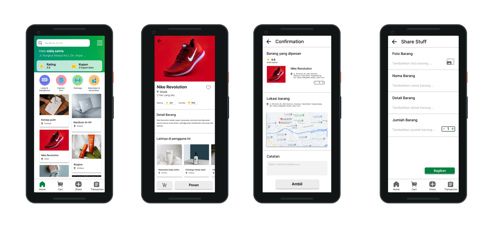

<p align="center">
  <h1 align="center">Stuffy App</h1>
  <h3 align="center">Share your stuff for the world </h3>

</p>

# Table of Contents
1. [Meet the Team](#Meet-the-Team)
2. [About Stuffy](#About-Stuffy)   
3. [Highlight Features](#Highlight-Features)
4. [Products](#Products)
    1. Android Application
    2. Machine Learning
    3. REST API

# Meet the Team


|         Member              | Student ID |        Path        |
| :--------------------:      | :--------: | :----------------: | 
|   Azizah Azzahra        |  M2128F1567  |  Machine Learning  | 
|   Ummi Sri Rahmadhani   |  M2308F2650  |  Machine Learning  |   
|  Muhammad Iqbal Fachry Krisbudiana      |  A2308F2647  | Mobile Development |       
|  Sidiq Satria Tama              | A2296F2508  | Mobile Development |         
|     Nurul Laili        |  C2308F2644  |  Cloud Computing   |          
|         Rima Tsaniyah Amilatus Sholihah              |  C2296F2511  |  Cloud Computing   |              

# About Stuffy

Stuffy’s Stuffy App make you can share the stuff waste for free

# Highlight Features

Here are our for our highlighted features:

```
1. Share Free Stuff
2. Detect Stuff Category And Condition

```

# Products

Link to each of our repository:
1. [Mobile Development Repository](https://github.com/iqbalfachry/Stuffy)
2. [Machine Learning Repository]
3. [Stuffy REST API]
4. [Cloud Architecture]

## Android
![kotlin-badge] ![firebase-badge]



### Main Feature

<ul>
  <li>Login</li>
  <li>Register</li>
  <li>Image picker</li>
  <li>Push notification</li>
  <li>Logout</li>
</ul>

### Tech Stack

<ul>
  <li>100% Kotlin</li>
  <li>AndroidX</li>
  <li>38 Jetpack Library</li>
  <li>RX Java</li>
  <li>Koin as Dependency Injection</li>
  <li>Firebase Cloud Messaging</li>
  <li>Glide</li>
  <li>Retrofit</li>
</ul>

### Architechture


MVVM with Clean Architechture for Easy to navigate, Maintainable and Testable code.

## Machine Learning

![tensorflow-badge] ![flask-badge]

We have these processes that will running in the cloud. In this development we use simulation that will run like this:


## Cloud Computing
![nginx-badge]


Why we use Cloud ?
- Low entry cost
- Ability to scale on-demand
- Go-to-market quicker
- Focus on core business

What we use ?
- Cloud Service : Google Cloud Platform
- Compute : E2 VM - Ubuntu20.04
- VPC: asia-southeast2/a
- DB : Cloud SQL - PostgreSQL
- Notification : Firebase
- Repo : Github
- Proxy : Nginx
- Web Server : PM2, Flask

## REST API
![node-badge] ![sql-badge] 

We are using **NodeJS** with **Express** Framework and **Firestore** as our development technology stack. This REST API
is used to support our Android Application.


[tensorflow-badge]: https://img.shields.io/badge/Tensorflow-Object%20Detection-FF6F00?style=flat&logo=Tensorflow
[flask-badge]: https://img.shields.io/badge/REST%20API-Stuffy%20API-FF6F00?style=flat&logo=flask
[kotlin-badge]: https://img.shields.io/badge/Android-Stuffy%20Application-FF6F00?style=flat&logo=kotlin
[firebase-badge]: https://img.shields.io/badge/Android-Notification%20Sender-FF6F00?style=flat&logo=firebase
[node-badge]: https://img.shields.io/badge/REST%20API-Stuffy%20API-FF6F00?style=flat&logo=express
[sql-badge]: https://img.shields.io/badge/REST%20API-Stuffy%20API-FF6F00?style=flat&logo=postgresql

[nginx-badge]: https://img.shields.io/badge/Cloud%20Computing-Nginx-FF6F00?style=flat&logo=nginx
[gcp-badge]: https://img.shields.io/badge/Cloud%20Computing-Nginx-FF6F00?style=flat&logo=nginx
